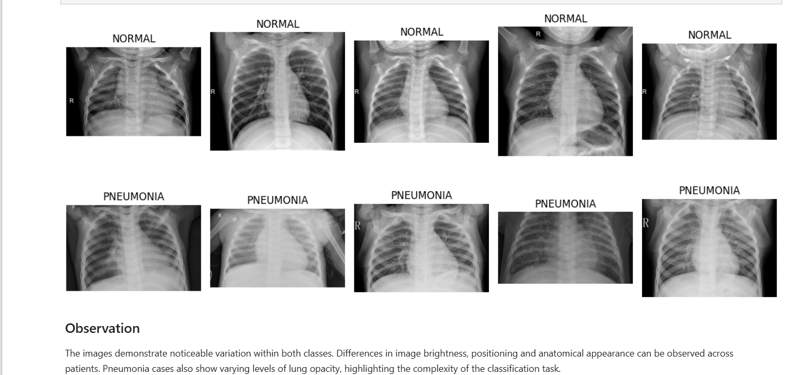
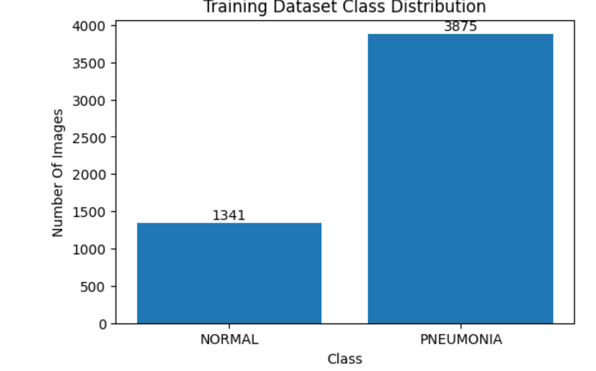
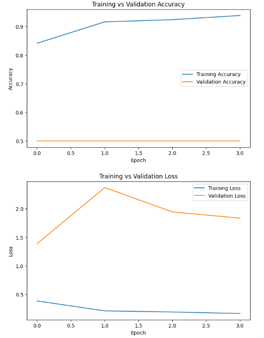
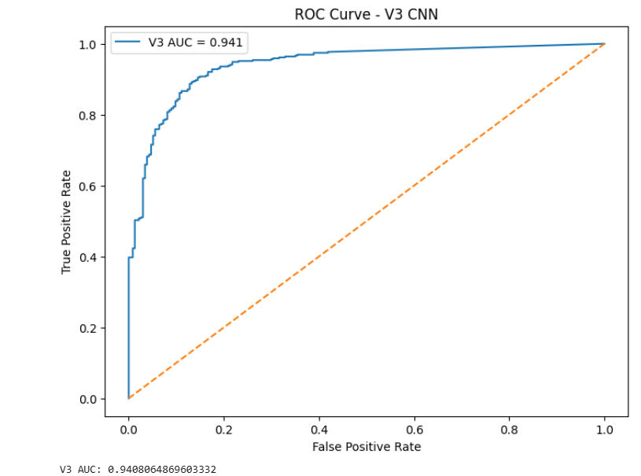
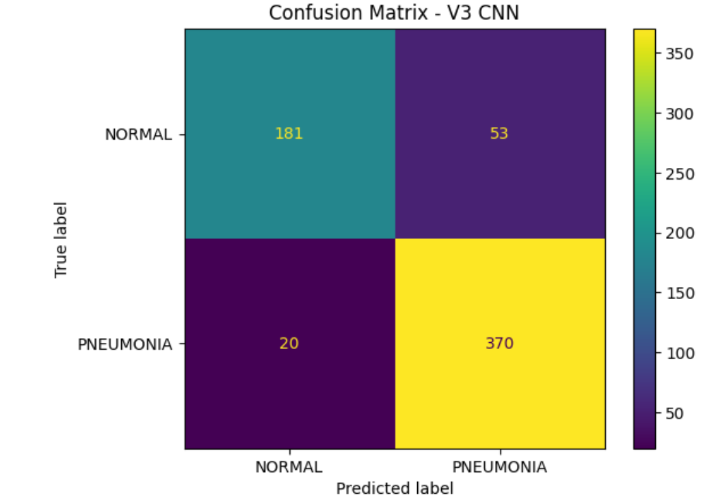
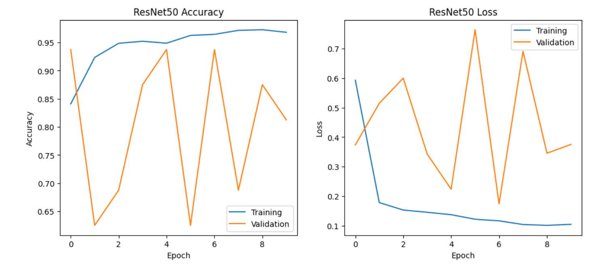
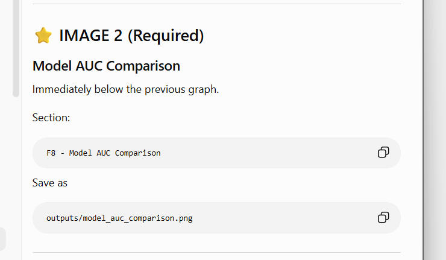
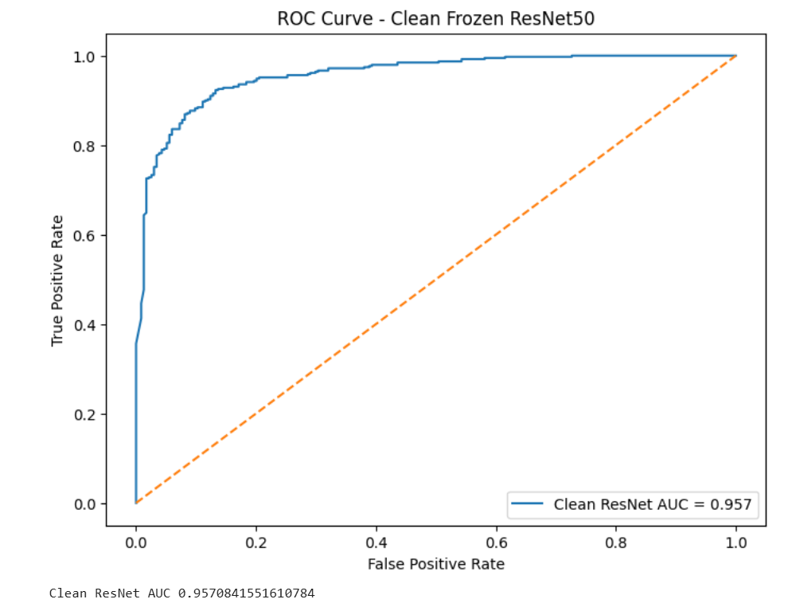
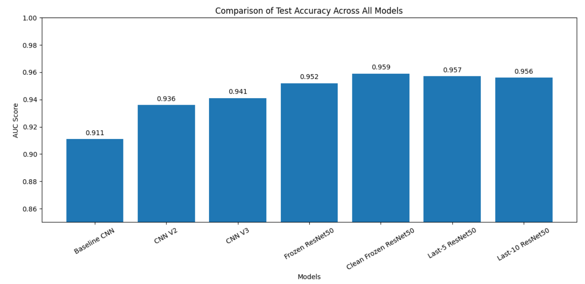

# 🩺 Medical Image Classification using Deep Learning (CNN & ResNet50)


---

## 📖 Project Overview

This project develops and evaluates multiple deep learning models for automated pneumonia detection from chest X-ray images.

Several custom Convolutional Neural Networks (CNNs) were designed and compared with transfer learning using a pre-trained ResNet50 model. The objective was to investigate how different architectures influence classification performance while identifying the model that provides the best balance between accuracy and generalisation.

The project also includes image preprocessing, class imbalance handling, model evaluation, threshold analysis and deployment through a Streamlit application.

---

## 🎯 Objectives

- Develop custom CNN architectures for pneumonia detection
- Compare multiple CNN models
- Apply transfer learning using ResNet50
- Handle class imbalance using class weights
- Evaluate models using multiple performance metrics
- Deploy the final model using Streamlit

---

# 🗂 Dataset

**Dataset**

Chest X-Ray Images (Pneumonia)

Source:

https://www.kaggle.com/datasets/paultimothymooney/chest-xray-pneumonia

Classes

- NORMAL
- PNEUMONIA

The dataset is **not included** in this repository because of GitHub size limitations.

Expected directory structure:

```text
data/
└── chest_xray/
    ├── train/
    ├── test/
    └── val/
```

---

# 📷 Dataset Samples



Example chest X-ray images used for model development.

---

# 📊 Dataset Class Distribution



The dataset is imbalanced, with significantly more pneumonia images than normal images. A class weighting strategy was implemented to reduce prediction bias during training.

---

# 🧠 Models Developed

The following models were implemented and evaluated.

| Model | Description |
|-------|-------------|
| Baseline CNN | Initial custom CNN architecture |
| CNN V1 | Reduced complexity CNN |
| CNN V2 | CNN with Batch Normalisation and Dropout |
| CNN V3 | Improved custom CNN architecture |
| Class Weight CNN | CNN trained using class weights |
| Frozen ResNet50 | Transfer learning using frozen ResNet50 |
| Fine-tuned ResNet50 | Transfer learning with unfrozen layers |

---

# 📈 Baseline CNN Training



Training and validation accuracy for the initial CNN model.

---

# 🎯 CNN V3 Evaluation

### ROC Curve



### Confusion Matrix



CNN V3 achieved the best performance among all custom CNN architectures.

---

# 🚀 Frozen ResNet50 Performance

### Training Curves



### Confusion Matrix



### ROC Curve



Transfer learning using a frozen ResNet50 provided the strongest balance between classification accuracy and generalisation.

---

# 📊 Model Comparison

### AUC Comparison



---

## 📋 Performance Summary

| Model | Test Accuracy | AUC |
|------|---------------:|------:|
| Baseline CNN | 80.00% | 0.911 |
| CNN V1 | 76.88% | - |
| CNN V2 | 80.94% | 0.936 |
| CNN V3 | 85.78% | 0.941 |
| Class Weight CNN | 80.94% | - |
| Frozen ResNet50 | **86.86%** | **0.952** |
| Last-5 ResNet50 | 77.56% | 0.957 |
| Last-10 ResNet50 | 75.64% | 0.956 |

---

# 🏆 Final Selected Model

**Frozen ResNet50**

Reasons for selection:

- Highest overall test accuracy
- Excellent AUC
- Better generalisation than fine-tuned models
- Stable validation performance
- Lower overfitting

---

# 💻 Streamlit Application

A Streamlit application was developed to allow users to upload a chest X-ray image and receive a prediction.

Run locally:

```bash
streamlit run pneumonia_app.py
```

---

# 📁 Repository Structure

```text
Medical-Image-Classification-CNN/
│
├── data/
│
├── outputs/
│
├── Medical_Image_Classification_CNN.ipynb
├── pneumonia_app.py
├── requirements.txt
├── README.md
└── .gitignore
```

---

# ⚙ Technologies Used

- Python
- TensorFlow
- Keras
- NumPy
- Pandas
- Matplotlib
- Scikit-learn
- Streamlit

---

# 🚀 Installation

Clone the repository

```bash
git clone https://github.com/a1899824-aditya/Medical-Image-Classification-CNN.git
```

Install dependencies

```bash
pip install -r requirements.txt
```

---

# 🔮 Future Improvements

- Train on a larger medical dataset
- Implement Grad-CAM visual explanations
- Experiment with EfficientNet and DenseNet
- Hyperparameter optimisation
- Cross-validation
- Docker deployment
- Cloud deployment

---

# 📄 Disclaimer

This project was developed for educational and portfolio purposes only.

It is **not intended for clinical diagnosis or medical decision-making.**
